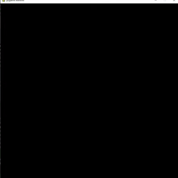
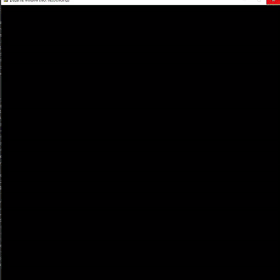
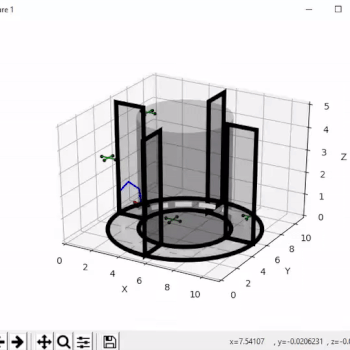

# Dynamic path planning of drones in static and dynamic environment in 2D and 3D:

## Overview:
In this project, we have use RRT and RRT* sampling based algorithms to perform path planning for drones. We have implemented the simulation both on 2D and 3D. Please refer to report for detailed description of the project in report/report.pdf.

## Sofware Used
Python version 3

## Visualization tools used
1. Pygame for 2D
2. Matplotlib for 3D

## Results obtained in 2D:
### To run RRT in 2D:
In 2D, we have used two different obstacle space to show the nodes exploration clearly. For running the code, please type the following commands:
```
cd code/RRT
python3 rrt.py
```
For running the second environment:
```
cd code/RRT
python3 rrt2.py
```
### Sample outputs:
Here are the sample output obtained by running the code:




For running RRT*, please type the following commands:
```
cd code/RRT
python3 rrt_star.py
```
For running the second environment:
```
cd code/RRT
python3 rrt_star2.py
```
### Sample outputs:
Here are the sample output obtained by running the code:




## Results obtained in 3D:
### To run the RRT in 3D:
Please execute the following commands:
```
cd DroneVavigation
python3 RunSimulation.py
```
### Sample outputs:



The left gif shows the path generated by RRT. The right gif shows an animation of drone following the path generated by RRT.